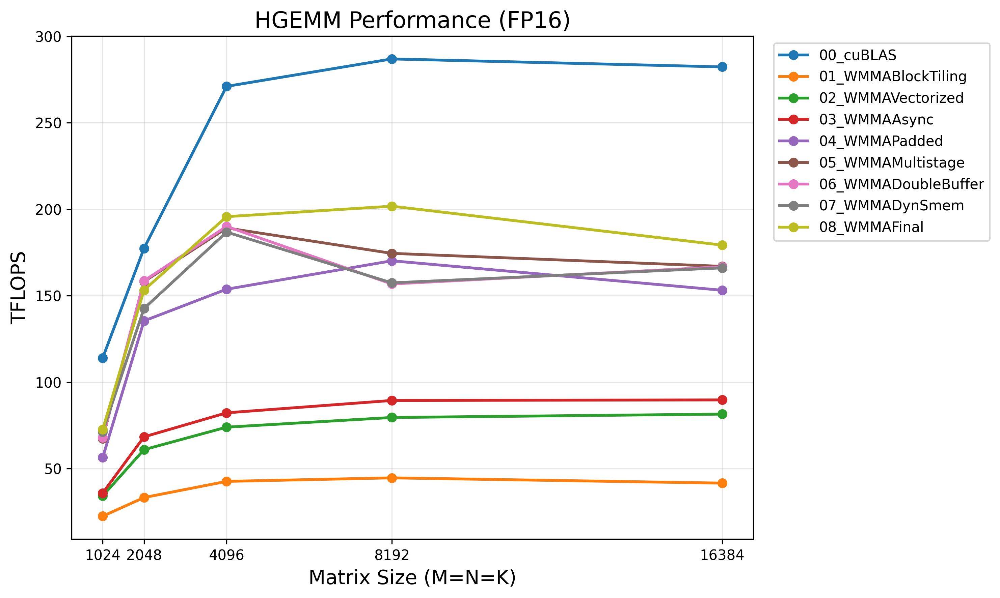

# Tensor Core HGEMM Optimization

A step-by-step exploration of FP16 GEMM optimization using NVIDIA Tensor Cores and the WMMA API.

## Requirements

- CUDA Toolkit (tested with 12.x)
- GPU with SM 80+ (Ampere or later) for async copy and tensor core features
- Python 3 + matplotlib (for plotting)

## Build & Run

Make sure to set `ARCH` to match your GPU architecture (e.g., sm_90, sm_80, etc.).

```bash
make ARCH=sm_80
./hgemm_bench
python3 scripts/plot_results.py hgemm_results.csv
```

## Kernel Progression

| Kernel | Description |
|--------|-------------|
| cuBLAS | cuBLAS reference (FP16 tensor cores) |
| 01_WMMABlockTiling | Block tiling baseline with WMMA fragments |
| 02_WMMAVectorized | + Vectorized global memory loads (float4) |
| 03_WMMAAsync | + Asynchronous GMEM→SMEM copies (cp.async) |
| 04_WMMAPadded | + Shared memory padding for bank conflict reduction |
| 05_WMMAMultistage | + Multi-stage pipeline (overlapped loads/compute) |
| 06_WMMADoubleBuffer | + Fragment double buffering |
| 07_WMMADynSmem | + Dynamic shared memory for larger tiles |
| 08_WMMAFinal | + Zig-zag MMA order, block swizzling, autotuning |

## Results

**NVIDIA A100-SXM4 (40 GB)**

The final kernel achieves **72% of cuBLAS** performance (196 vs 272 TFLOPS at N=4096).



| Kernel | N=4096 Time | TFLOPS | % cuBLAS |
|--------|-------------|--------|----------|
| cuBLAS (FP16) | 0.51 ms | 272.1 | 100% |
| 01_WMMABlockTiling | 3.23 ms | 42.6 | 16% |
| 02_WMMAVectorized | 1.85 ms | 74.3 | 27% |
| 03_WMMAAsync | 1.66 ms | 82.6 | 30% |
| 04_WMMAPadded | 0.89 ms | 154.5 | 57% |
| 05_WMMAMultistage | 0.73 ms | 189.0 | 69% |
| 06_WMMADoubleBuffer | 0.72 ms | 189.8 | 70% |
| 07_WMMADynSmem | 0.74 ms | 186.8 | 69% |
| 08_WMMAFinal | 0.70 ms | 195.7 | **72%** |

## Blog Post

For a detailed walkthrough of the optimization techniques, see the accompanying blog post:  
[Tensor Core HGEMM: A Progressive Optimization Guide Using WMMA](https://yencal.github.io/gpu-hgemm-wmma/)
